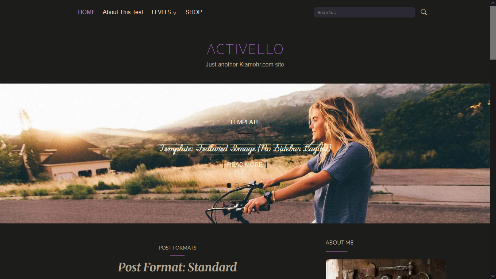
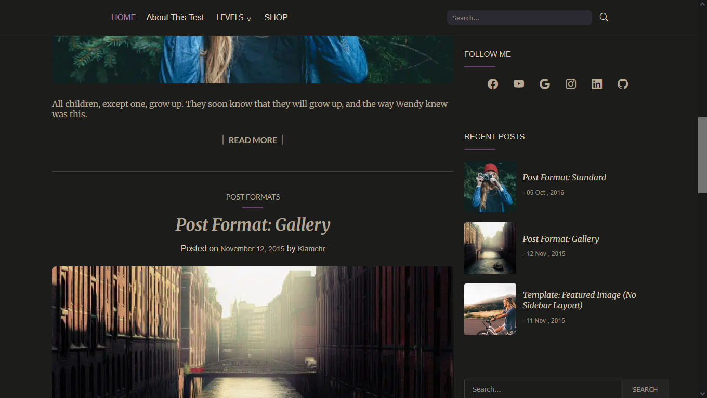
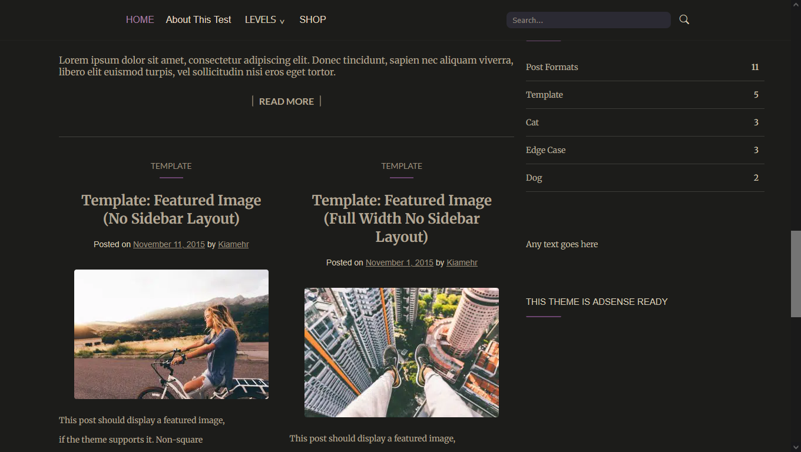
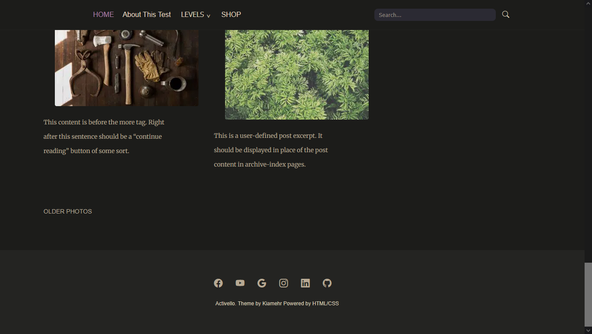

# 🌑 Activello Dark Mode Redesign



## About This Project

I redesigned **Activello**, the classic HTML/CSS blog theme, in **dark mode** — perfect for late-night coding sessions and aesthetic vibes. This project emphasizes:

- Sleek, dark background with soft accent colors (#ae80ac, #b7a993)  
- Smooth hover transitions and interactive elements  
- Fully responsive layout for posts, galleries, and sidebar widgets  
- Enhanced typography using **Playwrite US Trad Guides**, **Lato**, and **Merriweather**  
- Modern UI elements: dropdowns, search bars, post previews, and more  

This isn’t just a theme—it's an **immersive browsing experience**, designed with a minimalist, yet striking aesthetic in mind.

## Features

- ✅ Dark mode friendly design  
- ✅ Featured image layouts & gallery support  
- ✅ Modern hover effects for links and buttons  
- ✅ Sidebar widgets for recent posts, categories, search, and social links  
- ✅ Smooth typography integration

## Screenshots

### Side Layout


### Sidebar & Main


### Post Footer


## Getting Started

1. Clone the repo:

```bash
git clone https://github.com/kiyamehr/activello-dark-mode.git
````

2. Open `index.html` in your browser.
3. Explore the dark mode aesthetic and hover interactions.

## Credits

* Original theme by [Colorlib](https://colorlib.com)
* Redesigned and coded by **Kiamehr Moradi**

## Connect with Me

* [GitHub](https://github.com/kiyamehr)
* [LinkedIn](https://www.linkedin.com/in/kiamehr-moradi-005b40398/)

---

> “Darkness is the canvas; design is the brush.”
> — Kiamehr Moradi

```


Sample Source on colorlib:
[Colorlib/Activello](https://colorlibhub.com/activello/)

